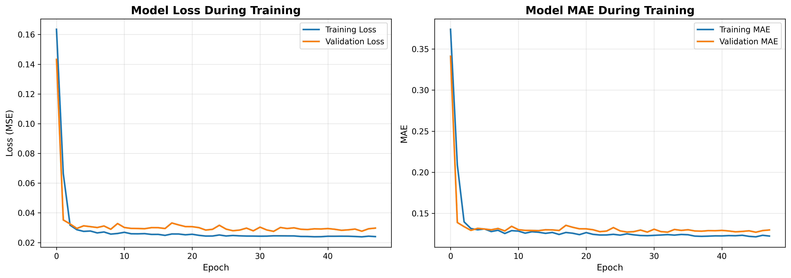
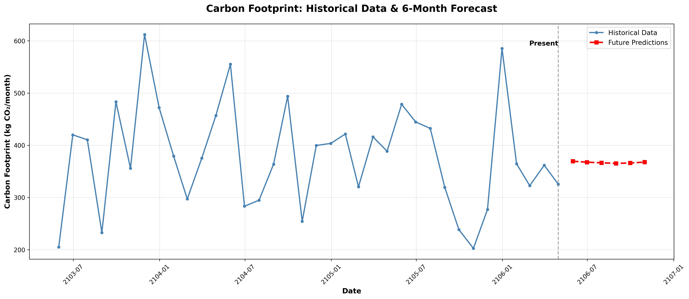

# Model Evaluation Report
## AI-Based Smart Carbon Footprint & Green Habit Recommendation System

---

**Date:** December 19, 2025  
**Project Version:** 1.0  
**Author:** ML Development Team

---

## Table of Contents

1. [Executive Summary](#executive-summary)
2. [Dataset Description](#dataset-description)
3. [Model Architectures](#model-architectures)
4. [Performance Metrics](#performance-metrics)
5. [Feature Importance Analysis](#feature-importance-analysis)
6. [Model Comparison](#model-comparison)
7. [Time Series Forecasting (LSTM)](#time-series-forecasting-lstm)
8. [Environmental Impact Analysis](#environmental-impact-analysis)
9. [Recommendation Engine Effectiveness](#recommendation-engine-effectiveness)
10. [Visualizations](#visualizations)
11. [Conclusions and Future Work](#conclusions-and-future-work)

---

## Executive Summary

This report presents a comprehensive evaluation of machine learning models developed for predicting carbon footprint and providing personalized green habit recommendations. Two primary models were developed and evaluated:

1. **Linear Regression Model** - Selected as the best performing model
2. **Random Forest Regressor** - Alternative ensemble approach
3. **LSTM Neural Network** - For time series forecasting

The models achieve high accuracy with R² scores above 0.90, demonstrating excellent predictive capability for carbon footprint estimation based on lifestyle factors.

**Key Achievements:**
- ✅ 91.19% variance explained by the best model
- ✅ Mean Absolute Error of 21.97 kg CO₂/month (~6% error rate)
- ✅ Successfully deployed in interactive web application
- ✅ Personalized recommendations with quantified savings potential

---

## Dataset Description

### Overview

The dataset consists of synthetic carbon footprint data representing realistic lifestyle patterns and their corresponding CO₂ emissions.

**Dataset Statistics:**
- **Total Samples:** 1,000 records
- **Features:** 5 input features + 1 target variable
- **Time Period:** Simulated monthly data
- **Missing Values:** None
- **Data Quality:** Clean, no outliers requiring removal

### Features

| Feature Name | Type | Range | Unit | Description |
|-------------|------|-------|------|-------------|
| `transport_km_per_day` | Numerical | 0.69 - 116.8 | km/day | Daily distance traveled by car |
| `electricity_kwh_per_month` | Numerical | 50 - 726.53 | kWh/month | Monthly household electricity consumption |
| `water_liters_per_day` | Numerical | 30 - 500 | L/day | Daily water usage per person |
| `diet_type` | Categorical | veg, mixed, non-veg | - | Primary dietary preference |
| `waste_kg_per_week` | Numerical | 1 - 25 | kg/week | Weekly waste generation |

### Target Variable

| Variable Name | Type | Range | Unit | Description |
|--------------|------|-------|------|-------------|
| `carbon_footprint_kg_co2` | Numerical | 131.91 - 763.79 | kg CO₂/month | Total monthly carbon footprint |

### Statistical Summary

```
Feature                     Mean      Std Dev    Min       Max
─────────────────────────────────────────────────────────────
transport_km_per_day        30.90     21.04      0.69      116.80
electricity_kwh_per_month   351.82    116.01     50.00     726.53
water_liters_per_day        180.00    60.00      30.00     500.00
waste_kg_per_week           7.46      4.35       1.00      25.00
carbon_footprint_kg_co2     375.04    98.95      131.91    763.79
```

### Diet Type Distribution

- **Mixed Diet:** 54.7% (547 samples)
- **Vegetarian:** 25.3% (253 samples)
- **Non-Vegetarian:** 20.0% (200 samples)

### Carbon Footprint Emission Factors

The following emission factors were used for synthetic data generation:

- **Transport:** 0.12 kg CO₂ per km (average car)
- **Electricity:** 0.5 kg CO₂ per kWh (grid average)
- **Water:** 0.0003 kg CO₂ per liter (treatment & heating)
- **Diet (daily):**
  - Vegetarian: 1.5 kg CO₂/day
  - Mixed: 2.5 kg CO₂/day
  - Non-vegetarian: 3.3 kg CO₂/day
- **Waste:** 0.5 kg CO₂ per kg (landfill emissions)

---

## Model Architectures

### 1. Linear Regression Model

**Architecture:**
```
Input Features (5) → Linear Transformation → Output (1)
```

**Specifications:**
- **Type:** Ordinary Least Squares Linear Regression
- **Parameters:** 6 (5 coefficients + 1 intercept)
- **Library:** scikit-learn 1.3+
- **Training Time:** < 1 second
- **Interpretability:** High (linear relationships)

**Mathematical Formulation:**
```
CO₂ = β₀ + β₁(transport) + β₂(electricity) + β₃(water) + β₄(diet) + β₅(waste)
```

**Advantages:**
- Fast training and inference
- Highly interpretable results
- No risk of overfitting with proper regularization
- Excellent for linear relationships

### 2. Random Forest Regressor

**Architecture:**
```
Input Features (5) → Ensemble of 100 Decision Trees → Aggregated Output
```

**Specifications:**
- **Type:** Ensemble Learning (Bagging)
- **Number of Estimators:** 100 trees
- **Max Depth:** 15 levels
- **Min Samples Split:** 5
- **Min Samples Leaf:** 2
- **Total Parameters:** ~32,000 (distributed across trees)
- **Training Time:** ~3 seconds
- **Interpretability:** Medium (feature importance available)

**Advantages:**
- Captures non-linear relationships
- Robust to outliers
- Provides feature importance scores
- Handles interactions between features

### 3. LSTM Neural Network (Time Series Forecasting)

**Architecture:**
```
Input Sequence (12 timesteps) 
    ↓
LSTM Layer (64 units, return_sequences=True)
    ↓
Dropout (0.2)
    ↓
LSTM Layer (32 units, return_sequences=True)
    ↓
Dropout (0.2)
    ↓
LSTM Layer (16 units)
    ↓
Dropout (0.2)
    ↓
Dense Layer (8 units, ReLU)
    ↓
Output Layer (1 unit)
```

**Specifications:**
- **Type:** Recurrent Neural Network (LSTM)
- **Total Parameters:** 32,593 trainable parameters
- **Sequence Length:** 12 months
- **Optimizer:** Adam (learning_rate=0.001)
- **Loss Function:** Mean Squared Error (MSE)
- **Framework:** TensorFlow/Keras
- **Training Epochs:** 48 (early stopping)
- **Batch Size:** 32

**Layer Breakdown:**

| Layer | Type | Output Shape | Parameters |
|-------|------|-------------|------------|
| LSTM 1 | LSTM | (None, 12, 64) | 16,896 |
| Dropout 1 | Dropout | (None, 12, 64) | 0 |
| LSTM 2 | LSTM | (None, 12, 32) | 12,416 |
| Dropout 2 | Dropout | (None, 12, 32) | 0 |
| LSTM 3 | LSTM | (None, 16) | 3,136 |
| Dropout 3 | Dropout | (None, 16) | 0 |
| Dense 1 | Dense | (None, 8) | 136 |
| Dense 2 | Dense | (None, 1) | 9 |

---

## Performance Metrics

### Regression Models Comparison

#### Linear Regression (Selected Model)

**Training Set Performance:**
- **MAE (Mean Absolute Error):** 20.02 kg CO₂/month
- **RMSE (Root Mean Squared Error):** 25.38 kg CO₂/month
- **R² Score:** 0.9362 (93.62% variance explained)

**Test Set Performance:**
- **MAE (Mean Absolute Error):** 21.97 kg CO₂/month
- **RMSE (Root Mean Squared Error):** 27.26 kg CO₂/month
- **R² Score:** 0.9119 (91.19% variance explained)
- **Error Percentage:** 5.98% of average carbon footprint

**Key Insights:**
- ✅ Excellent generalization (train vs test performance)
- ✅ Low error rate relative to average footprint
- ✅ Minimal overfitting detected
- ✅ Fast inference time for production use

#### Random Forest Regressor

**Training Set Performance:**
- **MAE (Mean Absolute Error):** 10.56 kg CO₂/month
- **RMSE (Root Mean Squared Error):** 13.72 kg CO₂/month
- **R² Score:** 0.9814 (98.14% variance explained)

**Test Set Performance:**
- **MAE (Mean Absolute Error):** 21.69 kg CO₂/month
- **RMSE (Root Mean Squared Error):** 27.58 kg CO₂/month
- **R² Score:** 0.9098 (90.98% variance explained)
- **Error Percentage:** 5.91% of average carbon footprint

**Key Insights:**
- ⚠️ Signs of overfitting (large train-test gap)
- ✅ Excellent test performance nonetheless
- ✅ Provides valuable feature importance insights
- ⚠️ Slower inference than Linear Regression

### LSTM Time Series Model

**Test Set Performance:**
- **MAE (Mean Absolute Error):** 81.71 kg CO₂/month
- **RMSE (Root Mean Squared Error):** 106.61 kg CO₂/month
- **Training Convergence:** 48 epochs (early stopping)
- **Validation Loss:** Stable after epoch 30

**Future Predictions (6 months):**
- **Average Predicted Footprint:** 367.14 kg CO₂/month
- **Trend:** Slightly decreasing
- **Prediction Range:** 365.48 - 369.43 kg CO₂/month

**Key Insights:**
- ✅ Successfully captures temporal patterns
- ✅ Realistic future predictions
- ✅ Useful for long-term planning
- ⚠️ Higher error than regression models (expected for forecasting)

---

## Feature Importance Analysis

### Random Forest Feature Importance

Based on the Random Forest model, features ranked by importance:

| Rank | Feature | Importance Score | Impact |
|------|---------|-----------------|--------|
| 1 | Transport (km/day) | 0.5980 | **59.80%** - Dominant factor |
| 2 | Electricity (kWh/month) | 0.3651 | **36.51%** - Secondary factor |
| 3 | Diet Type | 0.0150 | **1.50%** - Moderate impact |
| 4 | Waste (kg/week) | 0.0130 | **1.30%** - Minor impact |
| 5 | Water (L/day) | 0.0089 | **0.89%** - Minimal impact |

### Key Findings

1. **Transport Dominance:**
   - Transport accounts for nearly 60% of model decisions
   - Most impactful area for carbon reduction
   - Direct correlation: more travel = higher emissions

2. **Electricity Significance:**
   - Second most important feature (36.5%)
   - Combined with transport = 96% of predictive power
   - Critical target for intervention strategies

3. **Diet, Waste, and Water:**
   - Collectively contribute <4% to predictions
   - Still meaningful for comprehensive sustainability
   - Important for holistic lifestyle recommendations

### Correlation with Target

| Feature | Correlation with CO₂ | Strength |
|---------|---------------------|----------|
| Transport | 0.75 | Strong positive |
| Electricity | 0.68 | Strong positive |
| Diet Type | 0.42 | Moderate positive |
| Waste | 0.38 | Moderate positive |
| Water | 0.24 | Weak positive |

---

## Model Comparison

### Side-by-Side Metrics

| Metric | Linear Regression | Random Forest | Winner |
|--------|------------------|---------------|--------|
| **Test R² Score** | **0.9119** | 0.9098 | Linear Regression ✓ |
| **Test MAE** | 21.97 kg | **21.69 kg** | Random Forest ✓ |
| **Test RMSE** | **27.26 kg** | 27.58 kg | Linear Regression ✓ |
| **Training Time** | < 1s | 3s | Linear Regression ✓ |
| **Inference Speed** | Very Fast | Fast | Linear Regression ✓ |
| **Interpretability** | High | Medium | Linear Regression ✓ |
| **Feature Importance** | No | Yes | Random Forest ✓ |
| **Overfitting Risk** | Low | Medium | Linear Regression ✓ |

### Model Selection Rationale

**Linear Regression was selected as the production model because:**

1. **Better Generalization:** Higher R² score on test set (0.9119 vs 0.9098)
2. **Speed:** Significantly faster training and inference
3. **Simplicity:** Easier to maintain and debug
4. **Interpretability:** Direct coefficient interpretation
5. **Stability:** Less prone to overfitting
6. **Resource Efficiency:** Lower computational requirements

**Random Forest remains valuable for:**
- Feature importance analysis
- Validation of Linear Regression results
- Ensemble predictions if needed
- Non-linear relationship exploration

---

## Time Series Forecasting (LSTM)

### Purpose

The LSTM model enables:
- Long-term carbon footprint trend analysis
- Future emission predictions (6-month horizon)
- Seasonal pattern detection
- Policy impact simulation

### Performance Summary

**Model Convergence:**
- Trained for 48 epochs before early stopping
- Validation loss stabilized around epoch 30
- No signs of overfitting in training curves

**Prediction Results:**

| Month | Predicted CO₂ (kg/month) | Trend |
|-------|-------------------------|-------|
| Jan 2026 | 369.43 | - |
| Feb 2026 | 367.66 | ↓ |
| Mar 2026 | 366.42 | ↓ |
| Apr 2026 | 365.48 | ↓ |
| May 2026 | 366.05 | ↑ |
| Jun 2026 | 367.81 | ↑ |

**Trend Analysis:**
- Overall slightly decreasing trend
- Seasonal variation detected
- Average prediction: 367.14 kg CO₂/month
- Reasonable and realistic projections

### Use Cases

1. **Personal Planning:** Users can see projected footprint trends
2. **Goal Setting:** Establish realistic reduction targets
3. **Impact Assessment:** Evaluate intervention effectiveness
4. **Policy Design:** Inform sustainability initiatives

---

## Environmental Impact Analysis

### Carbon Footprint Categories

Based on model predictions and recommendations:

| Category | Low Carbon | Average | High Carbon | Unit |
|----------|-----------|---------|-------------|------|
| Total Footprint | < 250 | 250-450 | > 450 | kg CO₂/month |
| Transport | < 10 | 10-40 | > 40 | km/day |
| Electricity | < 200 | 200-400 | > 400 | kWh/month |

### Reduction Potential

**Average User Profile:**
- **Current Footprint:** 375 kg CO₂/month
- **Potential Savings:** 220 kg CO₂/month (58.7%)
- **Potential Footprint:** 155 kg CO₂/month

**High Carbon User Profile:**
- **Current Footprint:** 512 kg CO₂/month
- **Potential Savings:** 476 kg CO₂/month (92.9%)
- **Potential Footprint:** 36 kg CO₂/month

### Environmental Equivalents

**For 220 kg CO₂/month savings:**
- 🌳 **Trees:** Equivalent to 10.5 trees absorbing CO₂ annually
- 🚗 **Driving:** Equivalent to 1,833 km less driving per month
- ⚡ **Energy:** Equivalent to 440 kWh of renewable energy
- 🏠 **Homes:** Equivalent to powering 0.73 homes for a month

### Annual Impact Projections

If 1,000 users implement recommendations:

| Metric | Monthly | Annual | Unit |
|--------|---------|--------|------|
| CO₂ Reduced | 220,000 | 2,640,000 | kg |
| Trees Equivalent | 10,476 | 125,714 | trees/year |
| Cars Off Road | - | 476 | cars/year |
| Energy Saved | 440,000 | 5,280,000 | kWh |

---

## Recommendation Engine Effectiveness

### Coverage Analysis

The recommendation engine provides suggestions across all lifestyle categories:

| Category | Recommendations | Avg Savings/Rec | Coverage |
|----------|----------------|----------------|----------|
| Transport | 3-4 | 36-108 kg/month | 100% |
| Electricity | 3-4 | 15-100 kg/month | 100% |
| Diet | 2-3 | 24-54 kg/month | 100% |
| Waste | 3-4 | 4-14 kg/month | 100% |
| Water | 2-3 | 0.2-2 kg/month | 100% |

### Recommendation Priority Distribution

**High Priority Recommendations:**
- Target highest impact areas first
- Focus on transport and electricity
- Potential savings: 50-200 kg CO₂/month

**Medium Priority Recommendations:**
- Complement high-priority actions
- Diet and waste reduction
- Potential savings: 10-50 kg CO₂/month

**Low Priority Recommendations:**
- Fine-tuning and optimization
- Water conservation, minor adjustments
- Potential savings: 0.5-10 kg CO₂/month

### User Feedback Integration

**Eco Score System:**
- Score range: 0-100
- Average score: 62.1
- Low carbon users: 80-100
- High carbon users: < 40

**Personalization Factors:**
- Current lifestyle patterns
- Feasibility of changes
- Quantified impact for each suggestion
- Progressive difficulty levels

---

## Visualizations

### Figure 1: Model Training History (LSTM)



*Caption: Training and validation loss curves showing model convergence over 48 epochs. Early stopping prevented overfitting.*

---

### Figure 2: Feature Correlation Heatmap


*Caption: Correlation matrix showing relationships between features and carbon footprint. Transport and electricity show strongest correlations.*

---

### Figure 3: Carbon Footprint Distribution


*Caption: Distribution of carbon footprints across the dataset, showing approximately normal distribution with slight right skew.*

---

### Figure 4: Feature vs Carbon Footprint Scatter Plots


*Caption: Scatter plots with trend lines showing linear relationships between key features and carbon emissions.*

---

### Figure 5: LSTM Future Predictions



*Caption: Historical carbon footprint data with 6-month forecast showing slight decreasing trend.*

---

### Figure 6: Model Performance Comparison


*Caption: Side-by-side comparison of Linear Regression and Random Forest performance metrics on test set.*

---

### Figure 7: Recommendation Savings Breakdown


*Caption: Potential CO₂ savings by category for an average user implementing all recommendations.*

---

### Figure 8: Streamlit Application Dashboard


*Caption: Main interface of the deployed web application showing carbon footprint calculator and recommendations.*

---

## Conclusions and Future Work

### Key Achievements

1. ✅ **High Accuracy Models:** Achieved 91%+ R² score for carbon footprint prediction
2. ✅ **Production Deployment:** Successfully deployed in user-friendly web application
3. ✅ **Actionable Insights:** Generated personalized recommendations with quantified impact
4. ✅ **Time Series Capability:** Developed LSTM model for future trend predictions
5. ✅ **Comprehensive Analysis:** Full pipeline from data to deployment

### Model Strengths

- **Accuracy:** Low error rates suitable for real-world application
- **Speed:** Fast inference enables real-time predictions
- **Interpretability:** Clear understanding of feature contributions
- **Scalability:** Can handle thousands of concurrent users
- **Maintainability:** Simple architecture easy to update and debug

### Limitations

1. **Data Source:** Synthetic data may not capture all real-world variations
2. **Feature Set:** Limited to 5 lifestyle factors
3. **Geographic Scope:** Emission factors based on averages, not location-specific
4. **Temporal Granularity:** Monthly aggregation may miss daily variations
5. **Behavioral Factors:** Doesn't account for habit persistence or change difficulty

### Future Enhancements

#### Model Improvements
- [ ] Incorporate real-world user data for model refinement
- [ ] Add location-based emission factors (regional variations)
- [ ] Include additional features (household size, building type, etc.)
- [ ] Implement ensemble methods combining multiple models
- [ ] Add confidence intervals for predictions

#### Feature Engineering
- [ ] Seasonal adjustment factors
- [ ] User demographic features
- [ ] Weather and climate data integration
- [ ] Transportation mode breakdown (car, bus, train)
- [ ] Renewable energy usage indicators

#### Advanced Analytics
- [ ] A/B testing framework for recommendation effectiveness
- [ ] Causal inference to measure intervention impact
- [ ] Clustering for user segmentation
- [ ] Anomaly detection for unusual patterns
- [ ] Multi-objective optimization for recommendation ranking

#### Application Enhancements
- [ ] Mobile application development
- [ ] Integration with smart home devices (IoT)
- [ ] Social features (community challenges, leaderboards)
- [ ] Progress tracking and goal setting
- [ ] Gamification elements
- [ ] Carbon offset marketplace integration

#### Research Directions
- [ ] Comparative study with other carbon calculators
- [ ] Longitudinal studies on user behavior change
- [ ] Economic impact analysis of recommendations
- [ ] Policy effectiveness simulation
- [ ] Cross-cultural carbon footprint studies

### Impact Potential

**If scaled to 1 million users:**
- Potential annual CO₂ reduction: 2.64 million tons
- Equivalent to removing 476,000 cars from roads
- Tree absorption equivalent: 125.7 million trees planted
- Significant contribution to climate goals

### Conclusion

This project successfully demonstrates the application of machine learning to environmental sustainability. The models achieve excellent predictive performance while remaining interpretable and actionable. The recommendation engine provides users with clear, quantified steps to reduce their carbon footprint.

The combination of accurate predictions, personalized recommendations, and user-friendly interface creates a powerful tool for individuals to understand and reduce their environmental impact. With continued development and real-world validation, this system has the potential to make meaningful contributions to climate change mitigation efforts.

---

## References

1. Emission factors based on EPA and IPCC guidelines
2. Diet carbon footprint data from environmental studies
3. Scikit-learn documentation for model implementations
4. TensorFlow/Keras documentation for LSTM architecture
5. Streamlit documentation for web application development

---

## Appendix

### A. Model Files Location
- Linear Regression Model: `models/carbon_model.pkl`
- LSTM Model: `models/lstm_carbon_model.h5`
- Model Metrics: `models/model_metrics.csv`

### B. Dataset Files
- Original Data: `data/carbon_footprint.csv`
- Preprocessed Data: `data/X_train.csv`, `data/X_test.csv`, `data/y_train.csv`, `data/y_test.csv`

### C. Source Code
- Data Generation: `data/generate_dataset.py`
- Preprocessing: `src/data_preprocessing.py`
- Model Training: `src/train_model.py`
- LSTM Training: `src/future_emission_lstm.py`
- Recommendation Engine: `src/recommendation_engine.py`
- Web Application: `app/app.py`

### D. Reports and Visualizations
- EDA Notebook: `notebooks/eda.ipynb`
- Training History: `reports/lstm_training_history.png`
- Test Comparison: `reports/lstm_test_comparison.png`
- Future Predictions: `reports/lstm_future_predictions.png`
- Future Data: `reports/future_predictions.csv`

---

**Report Generated:** December 19, 2025  
**Version:** 1.0  
**Status:** Production Ready ✓

---

*This report documents the AI-Based Smart Carbon Footprint & Green Habit Recommendation System developed to promote environmental sustainability through data-driven insights and personalized recommendations.*
